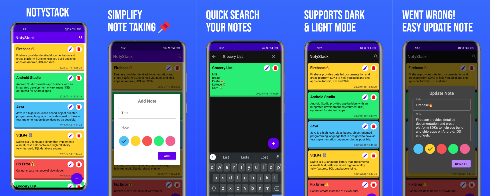
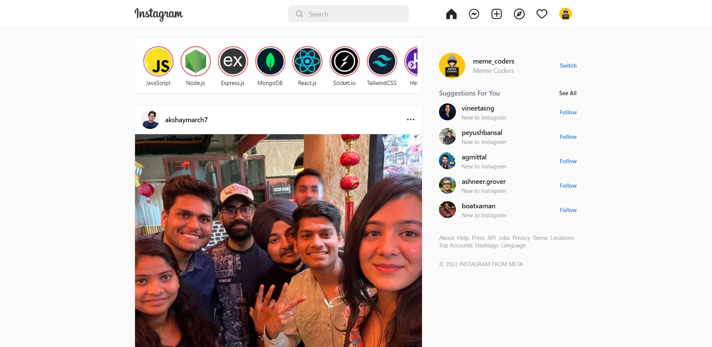
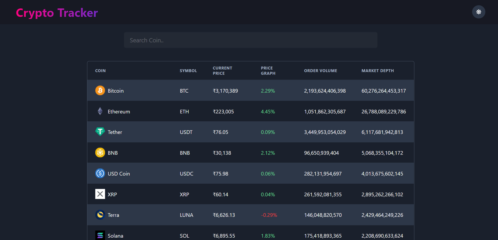

# Karthik Kumar Reddy Kota - AI/ML Engineer

  
   
  
  **AI/ML Engineer | Data Engineer | Full Stack Developer**
  
   
  
  
  
  
  

---

## 👨‍💻 About Me

I am an **AI/ML Engineer** with **3+ years of experience** building production-grade machine learning solutions in healthcare, finance, and telecom. 

- 🚀 Proven record of improving efficiency and enhancing decision accuracy.
- 🤖 Delivered automation that cut manual tasks by **25%+**.
- 📈 Recognized for scalable AI systems that drive measurable business impact.
- 🎓 **Master's in Computer Science** from University of North Texas.

---

## 🛠 Skills

| Language/Tool | Badge | Language/Tool | Badge |
|:---:|:---:|:---:|:---:|
| **Python** |  | **Java** |  |
| **TensorFlow** |  | **AWS** |  |
| **Docker** |  | **PostgreSQL** |  |
| **React** |  | **Pandas** |  |
| **JavaScript** |  | **Git** |  |

---

## 📂 Featured Projects

Here are some of my best works.

### 📱 Mobile & Android
| Project | Description | Preview |
| :--- | :--- | :---: |
| **NotyStack Android** | Fully fledged android CRUD app based on MVVM architecture.   **Tech:** Java, XML, SQLite, Firebase, RoomDB. |  |
| **NewsBox Android** | Native android app providing different category news.   **Tech:** Java, XML, Retrofit, Glide. |  |

### 💻 Web Development (MERN & More)
| Project | Description | Preview |
| :--- | :--- | :---: |
| **Instagram Clone** | Full-Stack Instagram clone with real-time chat.   **Tech:** MERN Stack, Socket.io. |  |
| **Flipkart Clone** | Full-Stack E-commerce app with Admin Dashboard & Payment Gateway.   **Tech:** MERN Stack. |  |
| **Hulu Clone** | Streaming service UI clone.   **Tech:** NextJS, TailwindCSS, TMDB API. |  |
| **Crypto Tracker** | Cryptocurrency tracking application with dark mode.   **Tech:** ReactJS, Chakra UI, CoinGecko API. |  |

---

## 💼 Experience

- **Full Stack Developer** - *Self Employed* (Oct 2021 - Present)
- **Web Developer Intern** - *Mapstreak Flyseas* (June 2021 - Dec 2021)
- **Website Developer Intern** - *The Spark Foundation* (May 2021 - June 2021)
- **Mobile App Developer Intern** - *The Spark Foundation* (April 2021 - May 2021)

---

## 🎓 Education

- **Master's in Computer Science** - University of North Texas (2023-2025)
- **B.Tech in CSE (Artificial Intelligence)** - Vellore Institute of Technology (2019-2023)

---

  <h3>Thanks for visiting! 👋</h3>
  
Feel free to reach out via <a href="mailto:r.karthik34521@gmail.com">Email</a> or <a href="https://www.linkedin.com/in/karthik-kumar-reddy-kota/">LinkedIn</a>

